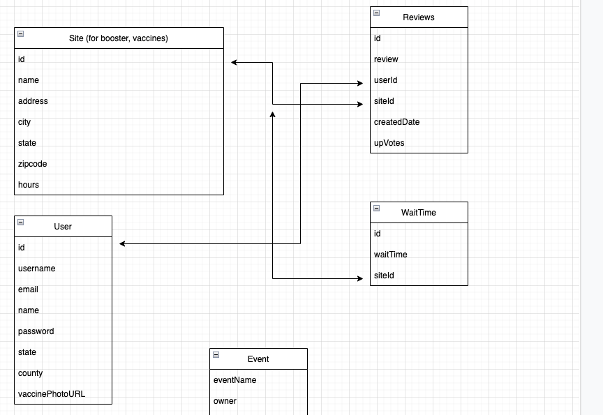
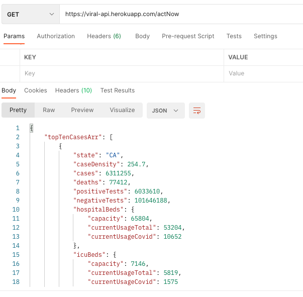

# Viral API

Viral is a MERN stack application used for finding the latest COVID information by location,
display latest COVID hotspots, and provide users information on where they can get vaccines and booster shots.
Users will be able to ‘vouch’ for vaccination sites and leave reviews to let others know if they are reliable.


The Viral API provides database management for sites, users, as well as COVID data from the ActNow API.

## Installation Instructions

```
- fork and clone
- npm install on terminal
- create .env file
- Add the following to the .env file
    - MONGO_URI: database connection string
    - JWT_SECRET: for authentication
    - COVID_API_KEY: for ActNow API connection
    - CLOUDINARY_NAME, CLOUDINARY_API_KEY, CLOUDINARY_API_SECRET: for cloudinary image upload connection

```


## Entity Relationship Diagram
The following ERD details the associations between the user, sites, and their reviews/wait time.



The database was created using the mongoose OdM. Associations were made as shown with reviews being referenced and wait times being embedded in sites: 


```js
const waitTimeSchema = new mongoose.Schema({
    waitTime:String,
})

const siteSchema = new mongoose.Schema({
    name: String, 
    address: String, 
    city: String, 
    state: String, 
    zipCode: Number, 
    phoneNumber: String,
    popularWaitTime: String,
    waitTimes: [waitTimeSchema]
})
```


```js
const reviewSchema = new mongoose.Schema({
    review: String, 
    createdDate: String, 
    upVotes: Number,
    upVoteArr: Array,
    downVotes: Number,
    downVoteArr: Array,
    userName: String,
    user: {
        type: mongoose.Schema.Types.ObjectId,
        ref: 'User'
    },
    site: {
        type: mongoose.Schema.Types.ObjectId,
        ref: 'Site'
    },
    userArr: Array,
    downVoteColor: String, 
    upVoteColor: String, 
})
```


### Act Now COVID API

Up to date COVID information was fetched from the Act Now API:

```js
  let api = await axios.get(`https://api.covidactnow.org/v2/county/${countyId}.json?apiKey=${COVID_API_KEY}`)
        let countyInfo = {
            fips: api.data.fips,
            state: api.data.state,
            county: api.data.county,
            population: api.data.population,
            caseDensity: api.data.metrics.caseDensity,
            cases: api.data.actuals.cases,
            deaths: api.data.actuals.deaths,
            newCases: api.data.actuals.newCases,
            newDeaths: api.data.actuals.newDeaths,
            vaccinationsInitiated: api.data.actuals.vaccinationsInitiated,
            vaccinationsCompleted: api.data.actuals.vaccinationsCompleted,
        };
```

### Cloudinary Image Storage

Cloudinary was used to store the vaccine photos uploaded by the user. A data URI is received for the photo, the cloudinary API is called, and a Public ID url from cloudinary is stored by the user. 

The same public ID is used to fetch the photo from cloudinary to render on the user's profile page on the front end.

Below is a code example for uploading to cloudinary:

```js
     //Upload to cloudinary
        const uploadedResponse = await cloudinary.uploader.upload(fileStr, {
            upload_preset: "viralapi"
        })
        let uploadedPublicID = uploadedResponse.public_id;

        //get the user, and update the vaccine photo url to the public ID from cloudinary
        const userId = req.body.userId;
        let user = await User.updateOne({
            _id: userId,
        }, {
            $set: { vaccinePhotoUrl: uploadedPublicID }
        })
```


### RESTful Routing

The following table illustrates the routes that are used by the server to allow the frontend application to interact with the database and needed APIs.

 Verb | URL | Description
 ----------- | ----------- | -----------
 GET | /users/profile | Get user information based on jwt token
 GET | /users/photo/:email | Gets the cloudinary publicID for the user vaccine photo
 POST | /users/photo | Receive a data URI of the uploaded Vaccine Photo, upload to cloudinary, and store public ID returned to user 
 POST | /users/signup |  Receives sign up info and creates user
 POST | /users/login |  Log in to an existing account
 POST | /users/update |  Update user information 
 GET | /site |  Get a list of all the vaccine sites 
 GET | /site/zip/:zip | Get a list of site and their wait time at a certain zip code, as well as any others in the same cities 
 GET | /site/:id | Get an individual site and its most popular wait time
 POST | /site/new | Create a new site 
 PUT | /site/updateWaitTime | Add a wait time to the vaccine site's wait time array
 GET | /review/:siteId | Get all the reviews for a specific site
 POST | /review/new |  Create a new review for a site
 POST | /review/comment |  Get a specific review 
 POST  | /review/vote |  Add an upvote to the review, as well as keep track of the user that upvoted
 POST | /review/downVote | Add an downvote to the review, as well as keep track of the user that downvoted
 GET | /actNow | Fetch COVID Data from the ActNow API for the top ten states based on cases, newCases, and deaths
 POST | /actNow/county | Fetch COVID Data from the ActNow API for a specific county
 GET | /countyData/counties |  Get a list of county names to display

 
 


## Postman Testing 

Use of postman for REST route testing:


 


## Major Hurdles
* One blocker we ran into was keeping track of which users have already voted on which reviews to avoid having a single user vote muliple times
* Another blocker was being able understand the differences between data URIs, files, and image URLs to be able to upload photos to cloudinary for storage. 